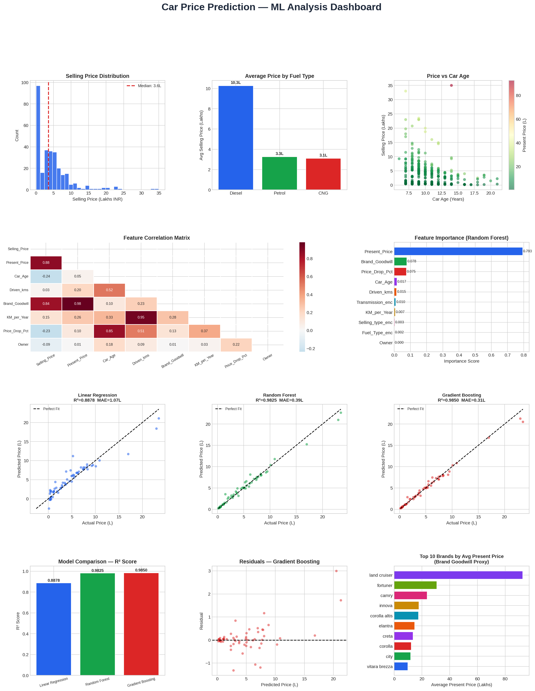

# 🚗 Car Price Prediction — ML Project

A complete end-to-end Machine Learning pipeline to predict used car resale prices.

## 📊 Dashboard Preview


## 🧠 Models Used
| Model | R² Score | MAE |
|---|---|---|
| Linear Regression | 0.8878 | ₹1.07L |
| Random Forest | 0.9825 | ₹0.39L |
| **Gradient Boosting** | **0.9850** | **₹0.31L** |

## 📁 Dataset
301 records, 9 features — fuel type, transmission, driven kms, brand, etc.

## 🔧 Tech Stack
Python · Pandas · Scikit-learn · Matplotlib · Seaborn

## 🚀 How to Run
```bash
pip install pandas numpy matplotlib seaborn scikit-learn
jupyter notebook Car_Price_Prediction.ipynb
```
